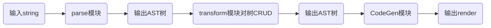

## 实现 compiler-core



构建相关模块

```ts
@packages/compiler-core
├── src
│   └── index.ts
└── __tests__
```

并导出模块

```ts
export * from './reactivity/src/index';
export * from './runtime-dom/src/index';
export * from './compiler-core/src/index';
```

### parse 模块的插值解析

