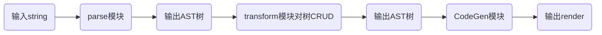

## 实现 compiler-core



构建相关模块

```ts
@packages/compiler-core
├── src
│   └── index.ts
└── __tests__
```

并导出模块

```ts
export * from './reactivity/src/index';
export * from './runtime-dom/src/index';
export * from './compiler-core/src/index';
```

### 实现 parse 模块的插值解析

**需求**

我们希望可以解析 `{{message}}` 为 AST 树, 插值语法的 AST 为

```ts
{
  type: NodeTypes.INTERPOLATION,
  content: {
    type: NodeTypes.SIMPLE_EXPRESSION,
    content: 'message',
  },
}
```
**实现**

- 定义枚举
  ```ts
  @packages/compiler-core/src/ast.ts
  export const enum NodeTypes {
    INTERPOLATION,
    SIMPLE_EXPRESSION,
  }
  ```
- 实现编译
  ```ts
  @packages/compiler-core/src/parse.ts
  import { NodeTypes } from './ast';

  // 构造上下文, 之后源码都从 source 里面取
  function createParserContext(content) {
    return {
      source: content,
    };
  }

  // 构造 Root 节点, 其只包含子节点属性
  function createRoot(children) {
    return {
      children,
    };
  }

  // 如果代码中包含 '{{' 就执行解析
  function parseChildren(context) {
    const nodes = [] as any[];
    let node = null as any;
    if (context.source.startsWith('{{')) node = parseInterpolation(context);
    node && nodes.push(node);
    return nodes;
  }

  // 找到一对最近的 {{ }}, 提取插值, 删除这个插值代码
  function parseInterpolation(context) {
    const closeDelimiter = '}}';
    const openDelimiter = '{{';

    const closeIndex = context.source.indexOf(
      closeDelimiter,
      openDelimiter.length
    );

    adviceBy(context, openDelimiter.length);

    const content = context.source
      .slice(0, closeIndex - openDelimiter.length)
      .trim();
    adviceBy(context, closeIndex);

    return {
      type: NodeTypes.INTERPOLATION,
      content: {
        type: NodeTypes.SIMPLE_EXPRESSION,
        content,
      },
    };
  }

  // 推进操作(删除已解析代码)
  function adviceBy(context, length) {
    context.source = context.source.slice(length);
  }

  // 解析器入口
  export function baseParse(content: string) {
    const context = createParserContext(content);
    return createRoot(parseChildren(context));
  }
  ```

### 实现 parse 模块的 Element 解析

**需求**

识别 `<xx></xx>` 的代码并解析为 AST 树, 其结构为

```ts
{
  type: NodeTypes.ELEMENT,
  tag: 'div',
  children: [],
}
```

**实现**

- 定义枚举
  ```ts
  export const enum NodeTypes {
    INTERPOLATION,
    SIMPLE_EXPRESSION,
    ELEMENT,
  }
  ```
- 实现解析函数
  ```ts
  // @packages/compiler-core/src/parse.ts
  // 识别条件 <字母模式, 这个定义看起来很宽松, 但是却是标准定义
  if (/^<[a-zA-Z]/.test(context.source)) node = parseElement(context);

  function parseElement(context) {
    const tagMatch = context.source.match(/^<([a-zA-Z]*)>.*<\/\1>/);
    const tag = tagMatch[1];
    adviceBy(context, tagMatch[0].length);
    return {
      type: NodeTypes.ELEMENT,
      tag,
    };
  }
  ```


### 实现 parse 模块的 Text 解析

**需求**

将不满足两种规范的代码识别为 Text 并解析为 AST 树, 其结构为

```ts
{
  type: NodeTypes.TEXT,
  content: 'bulabula',
}
```

**实现**

- 定义枚举: 略
- 返回 AST
  ```ts
  function parseText(context) {
    const content = context.source;
    adviceBy(context, content.length);
    return {
      type: NodeTypes.TEXT,
      content,
    };
  }
  ```

### 同时解析三种类型

**需求**

将 `<div>hi, {{message}}</div>` 解析为

```ts
{
  type: NodeTypes.ELEMENT,
  tag: 'div',
  children: [
    {
      type: NodeTypes.TEXT,
      content: 'hi, ',
    },
    {
      type: NodeTypes.INTERPOLATION,
      content: {
        type: NodeTypes.SIMPLE_EXPRESSION,
        content: 'message',
      },
    },
  ],
}
```

**实现**

- 修正 Element 使之可以解析 Element 标签内部文本

  ```diff
  function parseElement(context) {
  - const tagMatch = context.source.match(/^<([a-zA-Z]*)>.*<\/\1>/);
  + const tagMatch = context.source.match(/^<([a-zA-Z]*)>(.*)<\/\1>/);
    const tag = tagMatch[1];
    adviceBy(context, tagMatch[0].length);
    return {
      type: NodeTypes.ELEMENT,
      tag,
  +   children: parseChildren(createParserContext(tagMatch[2])),
    };
  }
  ```

- 修正 Text 解析使之可以在遇到插值 / Element 前导时停止解析

  ```diff
  function parseText(context) {
  + let content = context.source;
  + if (~content.indexOf('{{')) {
  +   content = content.slice(0, content.indexOf('{{') );
  + } else if (/<\/?[a-zA-Z].+/.test(content)) {
  +   content = content.slice(
  +     0,
  +     content.length - content.match(/<\/?[a-zA-Z].+/).length
  +   );
  + }
    adviceBy(context, content.length);
    return {
      type: NodeTypes.TEXT,
      content,
    };
  }
  ```

- 在一次解析并推进完成后继续解析剩余代码
  ```diff
  function parseChildren(context) {
    const nodes = [] as any[];
    let node = null as any;
  + while (context.source) {
      if (context.source.startsWith('{{')) node = parseInterpolation(context);
      else if (/^<[a-zA-Z]/.test(context.source)) node = parseElement(context);
      else node = parseText(context);
      nodes.push(node);
  + }
    return nodes;
  }
  ```

### 实现 Transform 模块

希望为 transform 传入一个函数组, 对每个节点执行这些函数. 我们只需要做一个 DFS 即可

- DFS
  ```ts
  import { NodeTypes } from './ast';
  import { TO_DISPLAY_STRING } from './runtimeHelpers';

  // 创建上下文并遍历
  export function transform(root, options = {}) {
    const context = createTransformContext(root, options);
    traverseNode(root, context);
    root.helpers.push(...context.helpers.keys());
  }

  // 创建上下文
  function createTransformContext(root: any, options: any): any {
    const context = {
      root,
      nodeTransforms: options.nodeTransforms || [],
      helpers: new Map(),
      helper(key) {
        context.helpers.set(key, 1);
      },
    };

    return context;
  }

  // 遍历节点, 如果是插值节点就调用 helper, ROOT 与 Element 就遍历子节点
  function traverseNode(node: any, context) {
    const exitFns: any = [];
    for (let i of context.nodeTransforms) {
      const onExit = i(node, context);
      onExit && exitFns.push(onExit);
    }

    switch (node.type) {
      case NodeTypes.INTERPOLATION:
        context.helper(TO_DISPLAY_STRING);
        break;
      case NodeTypes.ROOT:
      case NodeTypes.ELEMENT:
        traverseChildren(node, context);
        break;
      default:
        break;
    }

    let i = exitFns.length;
    while (i--) exitFns[i]();
  }

  // 遍历子节点
  function traverseChildren(node: any, context: any) {
    for (let child of node.children) traverseNode(child, context);
  }
  ```
- 定义枚举
  ```ts
  export const TO_DISPLAY_STRING = Symbol(`toDisplayString`);
  export const CREATE_ELEMENT_VNODE = Symbol("createElementVNode");

  export const helperNameMap = {
    [TO_DISPLAY_STRING]: "toDisplayString",
    [CREATE_ELEMENT_VNODE]: "createElementVNode"
  };
  ```
- 为 ROOT 打上 tag
  ```diff
  function createRoot(children) {
    return {
  +   type: NodeTypes.ROOT,
      children,
    };
  }
  ```

### 实现 compile 模块

需要将 AST 转换为代码字符串. 可以将 AST 分为四类

- Text
- 插值
- Element: children 只有一个元素 (e.g. `<div>as</div>` => `h('div', {}, 'as')`)
- Element: children 有多个元素 (e.g. `<div>as {{her}}</div>` => `h('div', {}, 'as' + her)`), 称之为复杂类型

处理最后一种 AST 需要在内容中解析出的每个元素之间用 ` + ` 连接

- 加入枚举类型
  ```diff
  export const enum NodeTypes {
    INTERPOLATION,
    SIMPLE_EXPRESSION,
    ELEMENT,
    TEXT,
    ROOT,
  + COMPOUND_EXPRESSION,
  }
  ```

- 代码生成
  ```ts
  import { isString } from '../../share';
  import { NodeTypes } from './ast';
  import {
    CREATE_ELEMENT_VNODE,
    helperNameMap,
    TO_DISPLAY_STRING,
  } from './runtimeHelpers';

  export function generate(ast) {
    const context = createCodegenContext(); // 创建上下文
    genFunctionPreamble(ast, context); // 创建依赖引入
    const functionName = 'render'; // 函数名
    const args = ['_ctx', '_cache']; // 函数参数
    const signature = args.join(', '); // 函数参数字符串
    context.push(`function ${functionName}(${signature}){`); // 连接函数头
    context.push('return ');
    genNode(ast.codegenNode, context); // 生成 AST 对应的内推
    context.push('}');
    return {
      code: context.code,
    };
  }

  function genFunctionPreamble(ast, context) {
    const VueBinging = 'Vue'; // 引用自的变量 `import {...} from Vue`
    const aliasHelper = (s) => `${helperNameMap[s]}:_${helperNameMap[s]}`; // 引用代码生成函数
    if (ast.helpers.length > 0) // 生成代码
      context.push(
        `const { ${ast.helpers.map(aliasHelper).join(', ')} } = ${VueBinging}`
      );
    context.push('\n');
    context.push('return ');
  }

  function createCodegenContext(): any {
    const context = {
      code: '',
      push(source) { // 将拼接代码功能写入 context
        context.code += source;
      },
      helper(key) {
        return `_${helperNameMap[key]}`;
      },
    };

    return context;
  }

  function genNode(node: any, context) { // 分类生成不同 AST 对应的代码
    switch (node.type) {
      case NodeTypes.TEXT:
        genText(node, context);
        break;
      case NodeTypes.INTERPOLATION:
        genInterpolation(node, context);
        break;
      case NodeTypes.SIMPLE_EXPRESSION:
        genExpression(node, context);
        break;
      case NodeTypes.ELEMENT:
        genElement(node, context);
        break;
      case NodeTypes.COMPOUND_EXPRESSION:
        genCompoundExpression(node, context);
        break;
      default:
        break;
    }
  }

  function genCompoundExpression(node: any, context: any) {
    for (let child of node.children)
      if (isString(child)) context.push(child);
      else genNode(child, context);
  }

  function genElement(node: any, context: any) {
    context.push(`${context.helper(CREATE_ELEMENT_VNODE)}(`);
    genNodeList(genNullable([node.tag, node.props, node.children]), context);
    context.push(')');
  }

  function genNodeList(nodes, context) {
    for (let i = 0; i < nodes.length; i++) {
      const node = nodes[i];
      if (isString(node)) context.push(node);
      else genNode(node, context);
      if (i < nodes.length - 1) context.push(', ');
    }
  }

  function genNullable(args: any) {
    return args.map((arg) => arg || 'null');
  }

  function genExpression(node: any, context: any) {
    context.push(`${node.content}`);
  }

  function genInterpolation(node: any, context: any) {
    context.push(`${context.helper(TO_DISPLAY_STRING)}(`);
    genNode(node.content, context);
    context.push(')');
  }

  function genText(node: any, context: any) {
    context.push(`'${node.content}'`);
  }
  ```
- 创建根节点的入口节点
  ```ts
  function createRootCodegen(root: any, context: any) {
    const { children } = root;
    const child = children[0];
    if (child.type === NodeTypes.ELEMENT && child.codegenNode) {
      const codegenNode = child.codegenNode;
      root.codegenNode = codegenNode;
    } else {
      root.codegenNode = child;
    }
  }
  ```
- Element 生成函数
  ```ts
  import { createVNodeCall, NodeTypes } from "../ast";

  export function transformElement(node, context) {
    if (node.type === NodeTypes.ELEMENT) {
      return () => {
        // tag
        const vnodeTag = `'${node.tag}'`;

        // props
        let vnodeProps;

        // children
        const children = node.children;
        let vnodeChildren = children[0];

        node.codegenNode = createVNodeCall(
          context,
          vnodeTag,
          vnodeProps,
          vnodeChildren
        );
      };
    }
  }
  ```
- 生成表达式
  ```ts
  import { NodeTypes } from "../ast";

  export function transformExpression(node) {
    if (node.type === NodeTypes.INTERPOLATION) {
      node.content = processExpression(node.content);
    }
  }

  function processExpression(node: any) {
    node.content = `_ctx.${node.content}`;
    return node;
  }
  ```
- 生成文本节点
  ```ts
  import { NodeTypes } from '../ast';
  import { isText } from '../utils';

  export function transformText(node) {
    if (node.type === NodeTypes.ELEMENT) {
      return () => {
        const { children } = node;

        let currentContainer;
        for (let i = 0; i < children.length; i++) {
          const child = children[i];

          if (isText(child)) {
            for (let j = i + 1; j < children.length; j++) {
              const next = children[j];
              if (isText(next)) {
                if (!currentContainer)
                  currentContainer = children[i] = {
                    type: NodeTypes.COMPOUND_EXPRESSION,
                    children: [child],
                  };

                currentContainer.children.push(' + ');
                currentContainer.children.push(next);
                children.splice(j, 1);
                j--;
              } else {
                currentContainer = undefined;
                break;
              }
            }
          }
        }
      };
    }
  }
  ```
- Text 节点与 string 判断函数
  ```ts
  export const isString = (value) => typeof value === 'string';

  export function isText(node) {
    return node.type === NodeTypes.INTERPOLATION || node.type === NodeTypes.TEXT;
  }
  ```

### 让 runtime-core 调用 compiler-core

runtime-core 会在确定 instance.render 时调用 compiler-core. 如果 setup 不返回函数, 组件没有自带 render 函数, runtime-core 会在有 template 时调用 compiler-core. compiler-core 会返回函数代码, 我们需要根据代码获得 render 函数

**测试代码**

```ts
import { h, ref } from '../../lib/micro-vue.esm.js';

export default {
  setup() {
    const message = ref('micro-vue');
    window.test = () => (message.value = 'hihi');
    return { message };
  },
  template: `<div>hi, {{message}}</div>`,
};
```

**实现**

- 构造 compiler-core 向外暴露的函数

  ```ts
  import { generate } from './codegen';
  import { baseParse } from './parse';
  import { transform } from './transform';
  import { transformExpression } from './transforms/transformExpression';
  import { transformElement } from './transforms/transformElement';
  import { transformText } from './transforms/transformText';

  export function baseCompile(template, options = {}) {
    const ast = baseParse(template);
    transform(
      ast,
      Object.assign(options, {
        nodeTransforms: [transformElement, transformText, transformExpression],
      })
    );
    return generate(ast);
  }
  ```
- 在 runtime-core 中加入编译 template 功能
  ```ts
  function finishComponentSetup(instance) {
    instance.render = instance.render || instance.type.render || compiler(instance.type.template);
  }
  ```
- 为 patchProps 加入兜底功能
  ```diff
  export function patchProps(elem: HTMLElement, oldProps = {}, newProps = {}) {
  + oldProps ??= {};
  + newProps ??= {};
    // ...
  }
  ```
- 导出 createElementNode
  ```ts
  export { createVNode as createElementVNode };
  ```
- 解决循环依赖问题: runtime-core 需要从 Vue 获取编译函数而 Vue 需要引用 runtime-core. 为了解决循环依赖, 可以让 runtime-core 暴露一个 SET 函数, 当文件加载完毕后调用祖册函数为 runtime-core 注册来自 compiler-core 的编译函数.
  - 在 runtime-core 中暴露注册函数
    ```ts
    let compiler;

    export function registerRuntimeCompiler(_compiler){
      compiler = _compiler;
    }
    ```
  - 在最外层引入
    ```ts
    export * from './reactivity/src/index';
    export * from './runtime-dom/src/index';

    import { baseCompile } from './compiler-core/src';
    import * as runtimeDom from './runtime-dom/src';

    // 将文本转换为函数的函数
    export function compileToFunction(template) {
      // 代码
      const { code } = baseCompile(template);
      // compiler-core 编译的函数形如
      //   import { createElementNode as _createElementNode } from Vue
      //   return _createElementVNode(...)
      // 我们希望获取 return 结果, 将这个代码段构造为函数
      //   function ff(Vue){
      //     import { createElementNode as _createElementNode } from Vue
      //     return _createElementVNode(...)
      //   }
      // 只需要传入 Vue 作为参数并获取函数运行结果即可
      // 无需 eval, 用 Function 即可构造函数. 并传入 Vue 即可
      return new Function('Vue', code)(runtimeDom);
    }

    // 将这个编译函数注入 runtime-core, runtime-core 即可拥有编译函数
    runtimeDom.registerRuntimeCompiler(compileToFunction);
    ```
- 编译后的函数需要两个参数, 传入相同值
  ```diff
  function componentUpdateFn(instance, container, anchor, patch) {
  - const subTree = instance.render.call(instance.proxy);
  + const subTree = instance.render.call(instance.proxy, instance.proxy);
    if (instance.next) {
      instance.vNode = instance.next;
      instance.props = instance.next.props;
      // ...
  }
  ```
